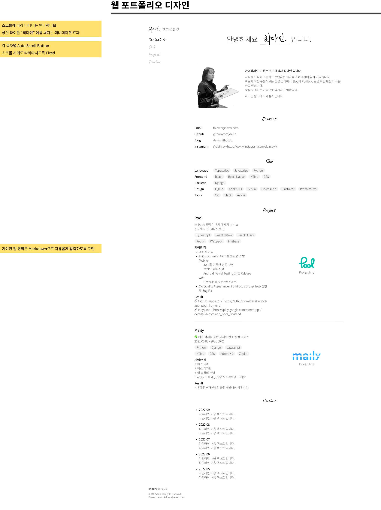

# 2일차, 포트폴리오 디자인 🙂

...

두구두구. 사실상 포트폴리오를 직접 만드는 과정에서 디자인이 제일 중요하다고 본다.
디자인이 깔끔하게 나오지 않는다면, 노션 등의 다른 플랫폼을 안쓰느니만 못할 것이기 때문이다.

비장한 각오로 Figma를 켜고 작업을 진행했다.

## Portfolio Design

피그마 링크로 확인할 수 있다.  
[🔗 https://www.figma.com/file/YvNRIQcmVTfUJaFiffhHcR/Dain-Portfolio?node-id=0%3A1](https://www.figma.com/file/YvNRIQcmVTfUJaFiffhHcR/Dain-Portfolio?node-id=0%3A1)

