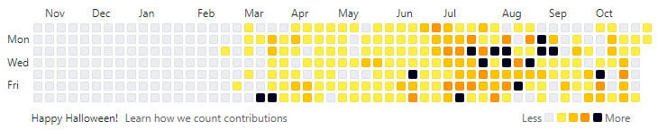
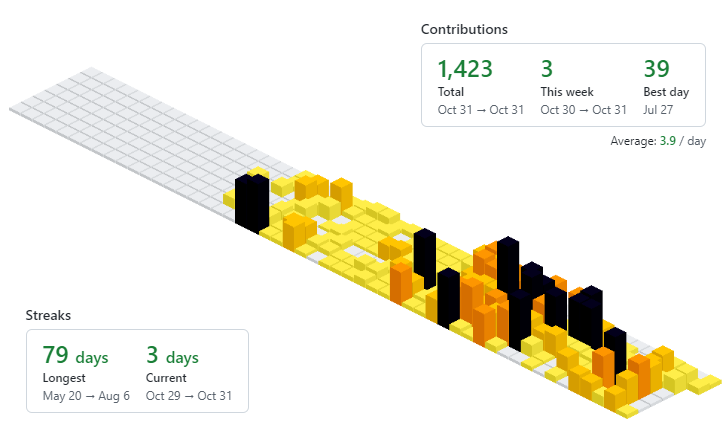
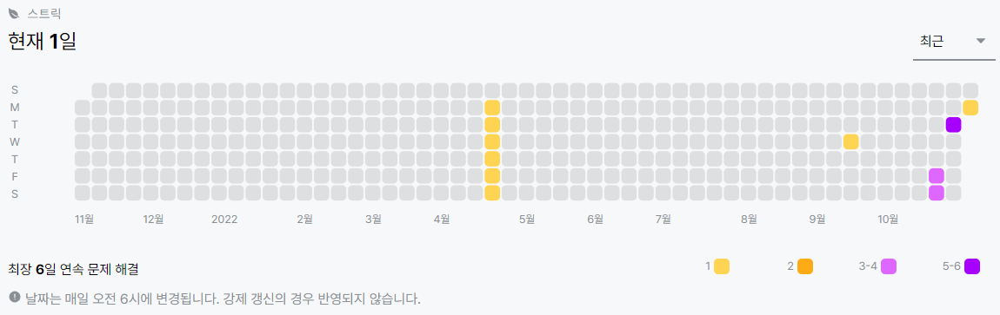

흔히들 깃허브 잔디라고 말하는 contribution. 깃허브의 초록초록한 커밋 기록을 채우는 건 잔디를 심는다고도 많이 표현했고, 아이덴티티였는데.
오늘 보니 깃허브 색이 변했다. 노랑 주황 검정색으로 변해있었다.

_Github Contribution 2D_
2D로 봤을 때에는 노란색이라 귀여운 느낌이다.

_Github Contribution 3D(Chrome Extension)_
커밋이 많은 날이 3D로 보면 아무래도 더 높은데, 검정색이니까 뭔가 조금 무서운 느낌이다. 검정색 이질감도 든다.

찾아보니 매년 **할로윈을 기념**하여 깃허브의 초록색 UI가 노란색으로 바뀐다고 한다.
_(왜 이제 알았지.)_ 할로윈 이외에도 몇몇 다른 색의 UI가 보이던데 또 나오면 기록해둬야겠다.

결론은 할로윈이 지나면 원래대로 돌아오니 당황하지 않고 개발하면 된다.

 

추가로 백준(BOJ) 난이도 측정 및 태깅을 해주는 사이트 **Solved.ac**에도 알고리즘 풀이 내역을 유사하게 제공하는데, 그 색도 노란색과 보라색 조합으로 변했다.
(아직 푼 내역이 없어서 머쓱... 하지만 이제 빽빽하게 풀거니까...!🙂)

_Solved.ac_

 
 

---

> 이태원 사고 사망자를 깊이 애도합니다.  
> Sending deepest condolences to the victims and their families affected by the Itaewon tragedy.
