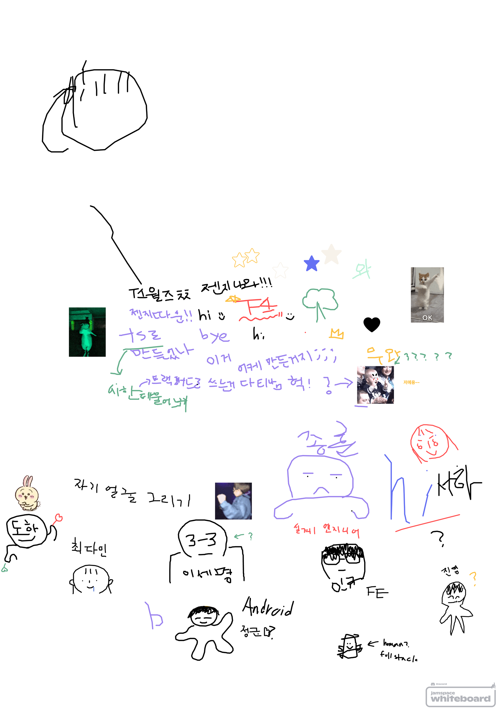
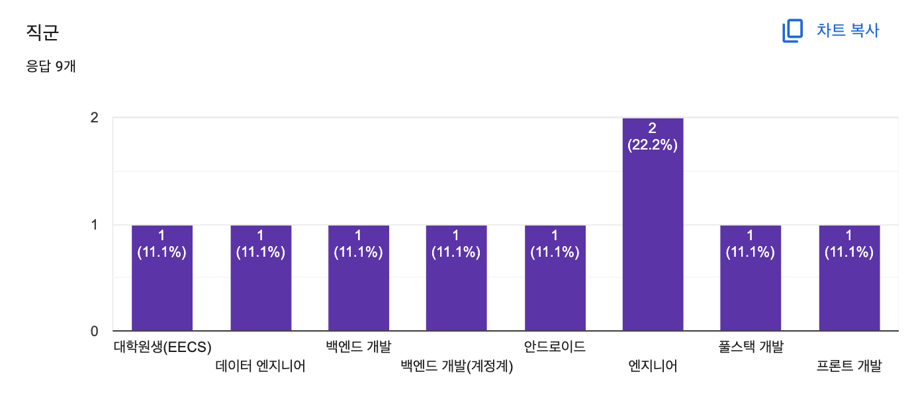
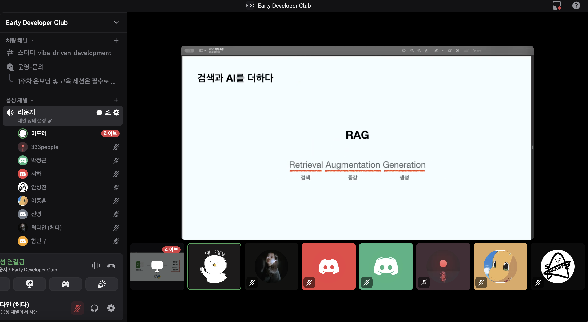

드디어 **Early Developer Club VDD 스터디**의 첫 번째 모임이 시작되었다! 🎉

12명의 스터디원들이 Discord 음성채널에 모여서 첫 만남을 가졌다. 온라인으로 진행되는 첫 모임이라서 어떻게 하면 모두가 편안하게 참여할 수 있을지 고민이 많았는데, 결과적으로 정말 좋은 시간이 되었다.

## 🎨 창의적인 자기소개 시간

자기소개는 특별한 계획 없이 진행하게 되었는데, Discord의 White Board 기능을 활용한 아이디어가 떠올랐다.

예전에 테오의 스프린트 프로그램 스탭으로 활동할 때, Figjam에서 그림 그리기 활동으로 아이스브레이킹을 진행했던 경험이 있었다. 그때 참가자들이 정말 적극적으로 참여했던 기억이 있어서, 비슷한 방식으로 접근해보면 어떨까 싶었다.

우리는 서로의 얼굴을 모르고 화상회의도 아니었기 때문에, **자신의 얼굴을 그리고 소개하는 활동**으로 자기소개를 진행하면 좋겠다고 생각했다. 온라인에서는 자칫하면 소극적이 될 수 있어서 참여를 유도하는 것이 중요한데, 이 방법이 아주 적절한 방안이었던 것 같다.

각자의 얼굴을 그리고 간략한 자기소개를 진행했다. 예상보다 훨씬 창의적이고 재미있는 자기소개들이 나왔다. 그림을 통해 각자의 개성이 드러나는 것도 흥미로웠다.

## 🌟 다양한 분야의 참여자들

자기소개를 들으니까 정말 다양한 분야의 사람들이 모였다는 것을 새삼 느꼈다. 특히 **비개발자도 있다는 점**이 놀라웠다.

AI를 삶에 적용하고자 하는 니즈는 개발자뿐 아니라 모두에게 있다는 걸 새삼 깨달았다. 각자의 전문 분야에서 AI 도구를 활용하고 싶어하는 사람들이 모인 것 같아서 더욱 의미 있는 모임이 될 것 같다.

어떤 분야의 사람들이 참여했는지에 대한 구체적인 조사 결과도 나왔다. 정말 다양한 배경을 가진 사람들이 모였다는 것을 확인할 수 있었다.

## 📚 온보딩과 스터디 소개

온보딩을 통해 Early Developer Club을 소개하고, 이번 VDD 스터디에서 각 주차별로 어떤 활동을 할 예정인지 설명하는 시간을 가졌다.

6주간의 여정에 대한 전체적인 로드맵을 공유했는데, 스터디원들의 반응이 좋았다. 구체적인 활동 내용은 앞으로의 포스팅을 통해 기록할 예정이니 여기서는 생략하겠다.

## 🤖 AI 기초 지식 공유 세션

기초 지식 공유 세션은 Early Developer Club을 함께 만든 **이도하**님이 마침 회사에서 비슷한 내용을 공유했던 자료가 있어서 짧게 진행하게 되었다.

**[AI 트렌드의 변화와 바이브코딩에 활용하기 좋은 툴들 소개]** 를 약 20분 정도 진행했는데, AI 분야가 처음인 나도 "이런 것들이 있구나" 하며 재미있게 들을 수 있었다.

최신 AI 트렌드와 실제로 활용할 수 있는 도구들에 대한 정보를 얻을 수 있어서 정말 유익한 시간이었다. 특히 바이브코딩에 직접적으로 도움이 될 만한 도구들을 소개받을 수 있어서 앞으로의 활동이 더욱 기대된다.

## ✨ 첫 모임을 마치며

이렇게 1주차 활동이 마무리되었다. 처음 온라인 모임이라서 걱정이 많았는데, 예상보다 훨씬 활발하고 재미있는 시간이 되었다.

특히 Discord White Board를 활용한 자기소개 활동이 정말 좋았다. 단순히 말로만 하는 자기소개보다 훨씬 창의적이고 기억에 남는 시간이었다. 앞으로도 이런 창의적인 활동들을 더 많이 기획해보고 싶다.

다양한 분야의 사람들이 모인 것도 큰 장점이었다. 서로 다른 관점에서 AI를 바라보고 활용하는 방법을 배울 수 있을 것 같다.

앞으로의 활동도 정말 기대된다! 🚀
