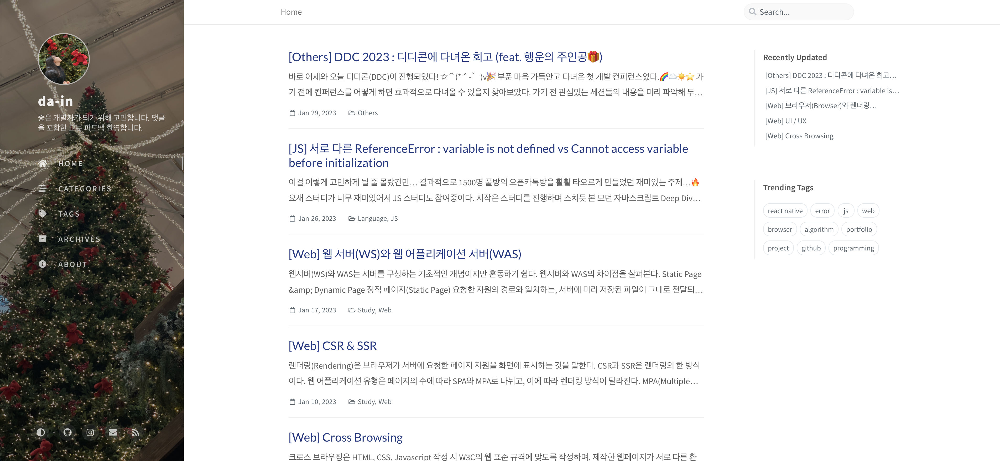
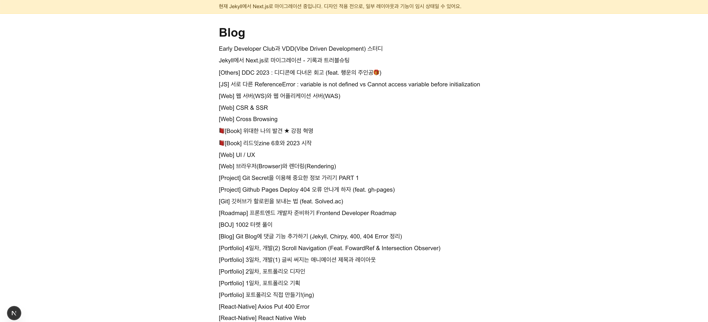

오늘은 블로그를 Jekyll에서 Next.js로 전환했다. 의사결정 배경부터 실제 마이그레이션 절차, 중간에 부딪힌 문제와 해결책, 그리고 앞으로의 TODO를 남긴다.

## 결정 배경 📝

처음엔 “Jekyll을 손보느냐, velog나 다른 플랫폼으로 갈아타느냐” 사이에서 꽤 고민했다. 결국엔 “내 리포지토리와 배포 파이프라인을 그대로 쓰면서, 포스트 발행을 자동화할 수 있는” 방향이 장기적으로 낫다고 판단했다. 그래서 기존 저장소를 유지하되, 엔진만 Next.js로 교체하는 쪽을 택했다.

- 이유 요약
  - 내 컨텐츠/도메인/워크플로우를 스스로 통제할 수 있다(락인 최소화) 🔒
  - CI/CD로 글 작성→커밋→자동 배포까지 이어지는 흐름이 깔끔하다 ⚙️
  - 기존 URL/이미지/댓글을 최대한 보존하며 점진적으로 개선할 수 있다 🔁

## 왜 Next.js인가 ✨

Jekyll은 간결했고 GitHub Pages와의 궁합도 좋았다. 하지만 블로그를 계속 성장시키려면, 실무에서 많이 쓰이는 스택과 생태계의 힘을 빌리고 싶었다. Next.js는 App Router와 강력한 SSG/ISR, MDX 확장성, SEO/이미지 최적화 같은 기본기를 튼튼하게 제공한다. 배포 역시 Vercel은 물론 GitHub Pages로의 정적 export도 수월하다. “지속 가능한 확장성 + 친숙한 DX”가 이번 선택의 핵심이었다. 🚀

## 마이그레이션 큰 흐름 🧭

먼저 별도 폴더(`next-site`)에 Next.js 프로젝트를 띄우고, Jekyll의 `_posts`를 그대로 복사해 렌더링을 확인했다. 홈 목록과 `/posts/[slug]` 상세를 만들고, Giscus로 댓글까지 연결. 그 다음 `output: 'export'` 기반으로 GitHub Pages 파이프라인을 구성해 정적 산출물(`out/`)을 `gh-pages`로 퍼블리시하도록 바꿨다. 마지막으로 레이아웃과 전역 CSS를 정리하고, 상단에 “마이그레이션 중” 배너를 추가해 방문자에게 현재 상태를 안내했다.

## 트러블슈팅 기록 🧯

처음 dev 서버를 띄웠을 때 `/`가 404를 뿜었다. 원인은 간단했다. 루트에 남아 있던 `app/` 디렉터리가 `src/app`을 가려버린 것. 잔여 폴더를 제거하고 재시작하니 말끔히 해결. 😅

CI에선 `@giscus/react` 모듈을 못 찾는 에러가 터졌다. 의존성 추가 후 다시 푸시했고, 빌드는 통과. 댓글 위젯이 제자리로 돌아왔다. 💬

GitHub Pages 배포에선 환경 보호 규칙 때문에 main에서 바로 배포가 막혔다. 그래서 워크플로우를 `gh-pages` 브랜치 퍼블리시 방식으로 바꾸고(`peaceiris/actions-gh-pages`), 필요 옵션(`force_orphan: true`, `contents: write`)을 더해 문제를 우회했다. 🚦

이미지가 꽤 큰 편이라 push 과정에서 `HTTP 400`으로 끊기는 일이 있었다. 일시적으로 `http.postBuffer`를 늘려 전송했고, 완료 후 원복했다. (네트워크 상태나 SSH 전환도 고려 대상)

가장 의미 있었던 오류는 정적 export 단계였다. `output: 'export'` 환경에선 동적 라우트를 사전에 모두 생성해야 한다. `/posts/[slug]`에 `generateStaticParams()`를 구현해 모든 슬러그를 미리 만들었고, 그 뒤로는 안정적으로 빌드가 떨어졌다. ✅

## 결과물

완전 태초의 상태로 돌아간 느낌이다. 앞으로 꾸밀 생각을 하니 신난다.


_리뉴얼 이전 화면_


_리뉴얼 이후 화면_

## 현재 구조

```
src/
  app/                # App Router
  components/         # UI 컴포넌트 (Giscus 등)
  content/posts/      # 마크다운 포스트 원본
  lib/                # 마크다운 로더
public/               # 정적 자산 (루트 규약 유지)
next.config.ts        # output: 'export'
tsconfig.json         # paths: @/* -> src/*
```

## 배포 파이프라인

- 빌드: `pnpm build` → `out/` 생성
- 배포: GitHub Actions가 `out/`를 아티팩트로 받아 `gh-pages` 브랜치에 퍼블리시
- Pages 설정: `gh-pages` 브랜치 기준

## 남은 TODO

- [ ] 슬러그 호환성 개선: 한글/특수문자 기존 링크 최대 보존
- [ ] 태그/카테고리 라우트: `/tags`, `/categories` 인덱스+상세
- [ ] 피드(`/feed.xml`) 추가: Atom/RSS 정적 생성
- [ ] 코드 하이라이트/목차(remark/rehype or shiki) 적용
- [ ] 검색: Fuse.js(간단) → 필요 시 Pagefind/Algolia
- [ ] SEO: `sitemap.xml`, `robots.txt`, 기본 메타 템플릿
- [ ] 404/리다이렉트: 변경된 경로 301 매핑(필요 시)
- [ ] 스타일 정리: 다크모드/본문 타이포/코드 블록 스타일
- [ ] 문서: CONTRIBUTING, ISSUE/PR 템플릿

---

앞으로는 디자인을 정비하고(레이아웃, 타이포, 색상 체계) 검색/SEO/태그 페이지까지 정리해 완성도를 끌어올릴 계획이다. 이번 전환으로 개발 생산성과 확장성이 크게 좋아졌다.
