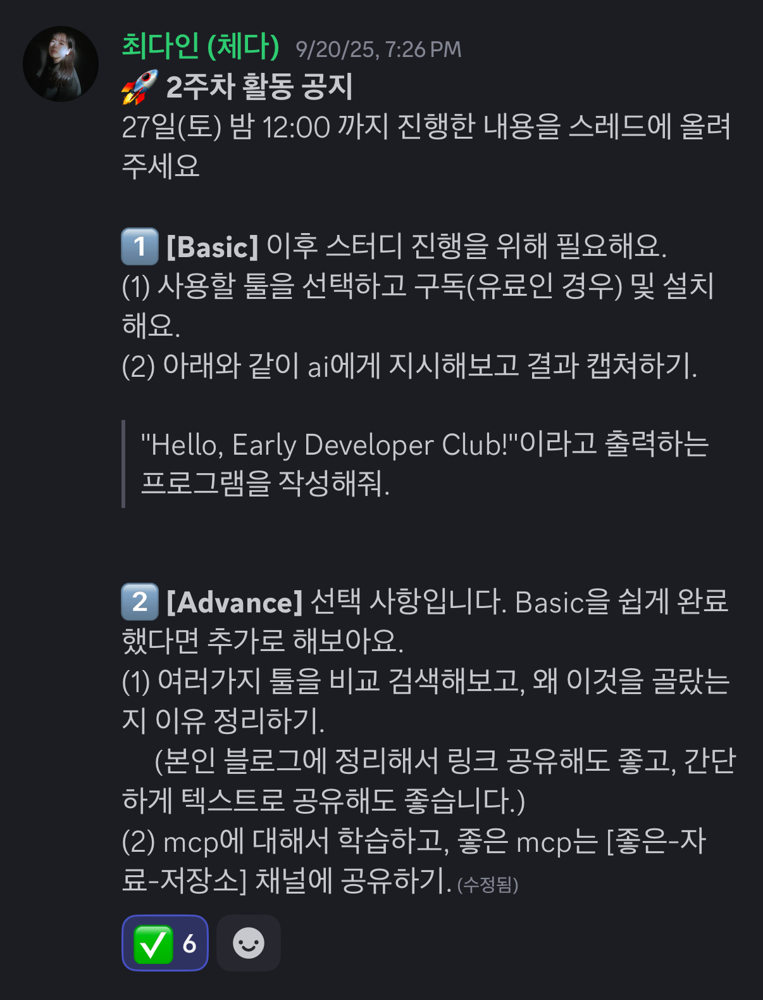
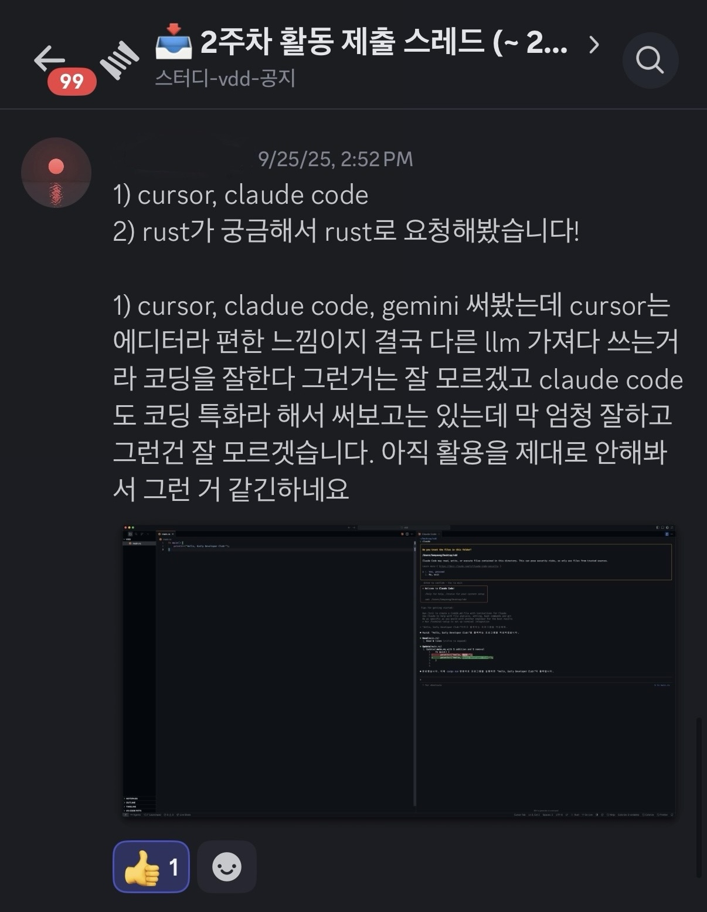
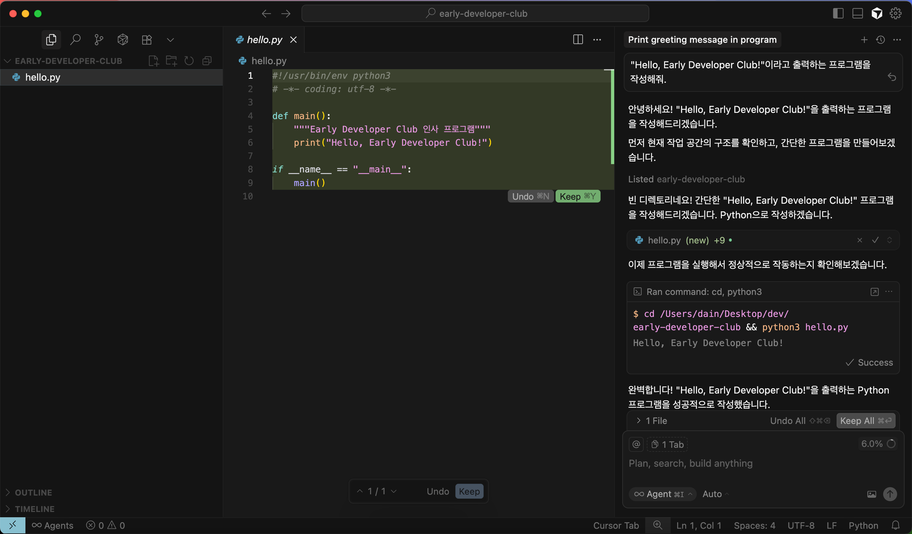
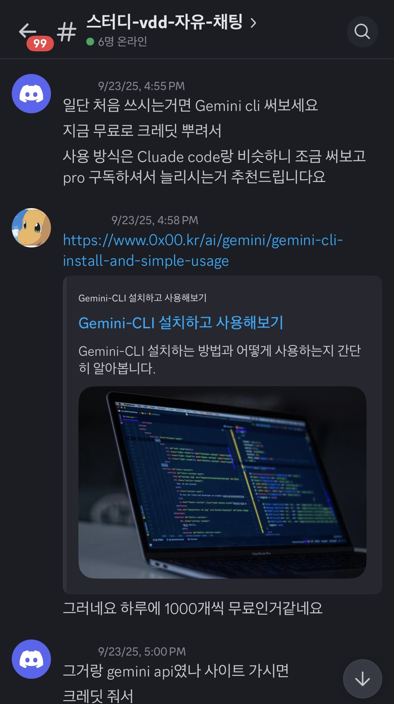

## 개요

2주차는 본격적인 바이브 코딩에 들어가기 전 사용할 도구들을 살펴보고 각자 환경을 세팅하는 시간을 가졌다. 저마다 계정 생성과 기본 설정을 차근차근 진행했다. 모든 세팅이 끝난 뒤에는 AI에게 "Hello, World"를 출력하는 아주 간단한 프로그램 생성을 지시하여 VDD 방식의 첫 손풀기를 진행했다.

## 진행 결과

비개발자도 있어 어려움이 있지 않을까 걱정했지만, 그런 우려는 금세 사라졌다. 12명의 스터디원 모두가 과정을 무사히 마쳤고, 일부는 자신의 관심 분야에 맞춰 추가 실험까지 진행했다. 중간중간 질문을 주고받으며 자연스럽게 흐름을 이어갔고, 작은 난관을 함께 넘는 경험이 스터디의 분위기를 한층 단단하게 만들어 주었다. ✨

## 도구 논의와 참고 자료 공유

세팅이 어느 정도 정리되자 자연스럽게 각 툴의 장단점에 대한 의견이 오갔다. 어떤 도구가 어느 상황에서 더 편한지, 처음에 무엇을 눌러야 덜 헤매는지, 프롬프트를 어떻게 써야 답변 품질이 좋아지는지 등 실전 팁이 빠르게 공유됐다. 참고하면 좋은 문서와 튜토리얼 링크도 채널에 공유되었다.

## 다음 단계

이로써 준비는 끝났다. 각자 손에 맞는 환경이 갖춰졌고, AI에게 말을 걸어 결과를 얻는 흐름도 체감했다. 이제 남은 일은 한 걸음 더 나아가 실제 결과물을 만들어 보는 일이다.

3주차에는 작은 주제를 정해 바이브 코딩으로 구현을 시도하고, 그 과정에서 느낀 점과 배운 점을 기록할 예정이다. 🚀
