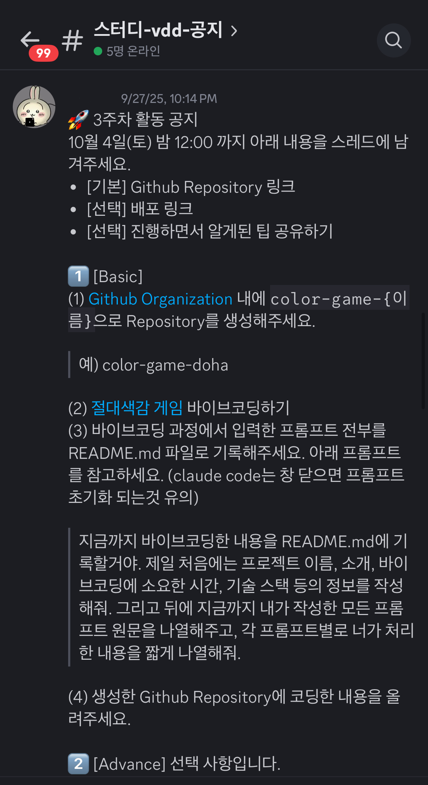
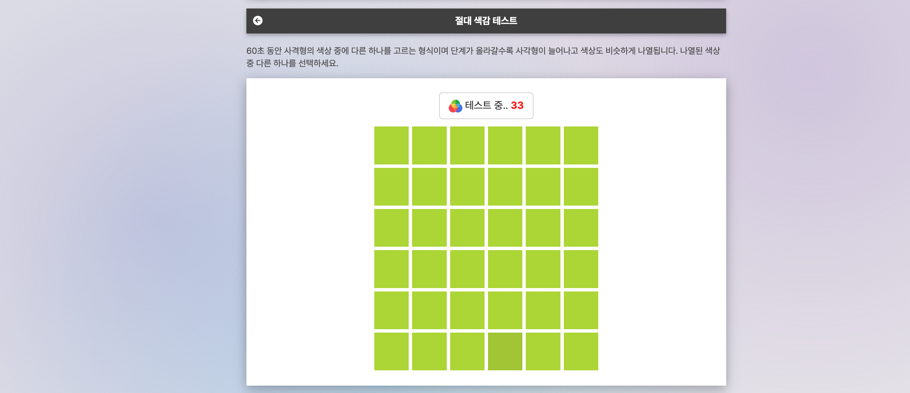
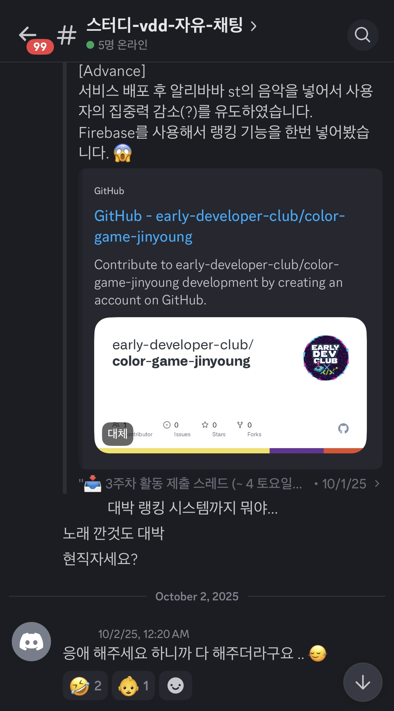
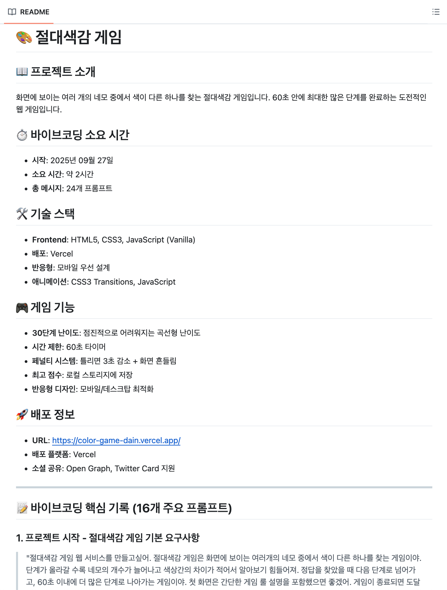

## 개요

3주차는 자유로운 프로젝트에 들어가기 전, 다 같이 손을 맞춰보는 **간단한 바이브 코딩 실습**으로 진행했다. 활동 공지를 통해 주제와 목표, 제출 방법을 안내했고 모임에서는 바로 구현에 들어갔다.

## 절대색감 게임 만들기 🎨

주제는 이른바 **절대 색감 게임**이었다. 미묘하게 색감이 다른 블록을 찾아 클릭하는 간단한 규칙의 게임으로, 웹 개발 경험이 없는 사람도 도전해볼 수 있도록 난이도를 조정했다. “웹을 처음 해보는 사람도 사이트를 만들 수 있을까?”라는 설렘 속에서 실습을 시작했다.

참고용 링크도 함께 공유했다. 실제 게임의 인터랙션과 난이도 변화를 살펴보며 구현 방향을 잡을 수 있었다.

- 참고 링크: `https://www.jiraksil.com/service/color`

## 만들고, 배포하고, 함께 즐기기 🚀

각자는 자신만의 구현으로 게임을 만들고, 배포 링크를 스터디 채널에 공유했다. 서로의 결과물을 번갈아 플레이하며 재미를 나눴다. 스터디 외 지인들에게도 링크를 보내보며 반응을 확인한 경우도 있었다.

개발이 처음인 사람이 말하길, 응애 해주세요 하니까 다 해주더라.

## 기록을 통해 배우기 ✍️

이번 실습에서는 **바이브 코딩에 사용한 시간과 프롬프트**를 간단히 기록하도록 했다. 같은 서비스를 목표로 했지만, 프롬프트의 차이와 시간 투자 방식에 따라 전혀 다른 결과물이 나왔다. 누군가는 왜 이런 결과가 나왔는지 서로의 프롬프트를 비교해 보기도 했고, 매우 짧은 개발 시간에 구현된 결과물에 놀라워하기도 했다.

## 더 나아가기 🌟

일부 스터디원은 난이도 조절 로직을 고도화하거나, 라운드/점수 시스템, 사운드 이펙트 등 **개성 있는 기능**을 더해보기도 했다. 짧은 시간 안에도 충분히 재미있는 결과를 만들 수 있다는 자신감을 얻었다.

다음 주부터는 각자가 만들고 싶은 프로젝트를 자유롭게 진행한다. 준비는 끝났고, 이제는 **실전**이다. 🚀
